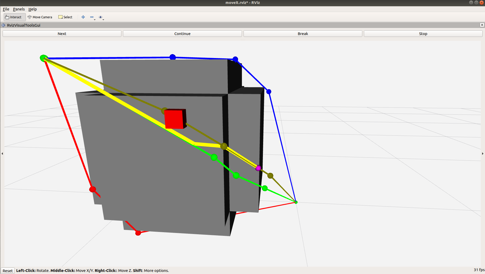

# online_replanner

The repository contains the implementation of an anytime path re-planner and optimizer. The re-planner avoids un-predicted obstacles and/or optimizes the current path switching between pre-computed paths. It is based on Moveit! to get information about the environment.

## Build/Installation
The software can be installed with the following [rosinstall file](online_replanner.rosinstall).

## Packages
### **graph_replanning**
It contains three classes:
 1. [replanner](https://github.com/JRL-CARI-CNR-UNIBS/online_replanner/blob/devel/graph_replanning/include/graph_replanning/replanner.h): given the current robot configuration and a set of pre-computed paths, it searches for a new path that avoids obstacles and/or optimize the current one.
 2. [replanner_manager](https://github.com/JRL-CARI-CNR-UNIBS/online_replanner/blob/devel/graph_replanning/include/graph_replanning/replanner_manager.h): it interpolates the robot trajectory and sends the new robot state, updates information about obstacles and continuously calls the replanner to avoid them or to optimize the current path.
 3. [trajectory](https://github.com/JRL-CARI-CNR-UNIBS/online_replanner/blob/devel/graph_replanning/include/graph_replanning/trajectory.h): it provides some useful methods to compute paths and trajectories.

### **graph_replanning_examples**
It contains some useful examples of usage of the replanner and replanner manager. It provides also a base on which run the replanner and/or the replanner manager on your robotic cell.

## Examples/Usage
The package **graph_replanning_examples** provides two examples of usage, one for the replanner and one for the replanner_manager.

### **replanner example**
[example_replanner_cartesian.cpp](https://github.com/JRL-CARI-CNR-UNIBS/online_replanner/blob/devel/graph_replanning_examples/src/example_replanner.cpp) is a ready-to-use example of the replanner functioning. In this example, the robot is a simple point moving in the three-dimensional Cartesian space, in which there is a large grey obstacle. Initially, a user-defined number of paths is computed considering the static grey obstacle and they are displayed on Rviz; then, a new obstacle (a red box) is placed on the current path (the dark green one). Finally, the replanner is called to find a new path, which will be displayed in yellow. The current robot configuration is represented as a pink sphere.
To run the example, type in the terminal:

`roslaunch graph_replanning_examples example_replanner_cartesian.launch`

[example_replanner_cartesian.yaml](https://github.com/JRL-CARI-CNR-UNIBS/online_replanner/blob/devel/graph_replanning_examples/config/example_replanner_cartesian.yaml) contains some parameters which can be changed.
These parameters are related to the robot definition, do not change them in this example:
```yaml
group_name: "cartesian_arm"
base_link: "world"
last_link: "end_effector"
```
These other parameters can be modified:
```yaml
display_step_by_step: false
number_paths: 4
max_time_for_replanning: 0.1
start_configuration: [0.0, 0.0, 0.0]
stop_configuration: [0.8, 0.8, 0.8]
```
If `display_step_by_step` is true, you can see the replanner algorithm execution step by step, its evolution and the intermediate solutions. You can advance in each step by pressing the button <kbd>Next</kbd> on Rviz. Note that if this parameter is true, no time constraints are given to the replanner.
`number_paths` defines the number of pre-comuted which the replanner will exploits to find a new free path.

### **replanner usage**
In order to use the replanner with your robotic cell, you need to do the following preliminary steps:

> Create a moveit package (see <a href="http://docs.ros.org/kinetic/api/moveit_tutorials/html/doc/setup_assistant/setup_assistant_tutorial.html">tutorial</a>)

> Copy and change the name of the files [example_replanner.launch](https://github.com/JRL-CARI-CNR-UNIBS/online_replanner/blob/devel/graph_replanning_examples/launch/example_replanner.launch) and [example_replanner.yaml](https://github.com/JRL-CARI-CNR-UNIBS/online_replanner/blob/devel/graph_replanning_examples/config/example_replanner.yaml) and modify the fields marked with CHANGE IT

> in RViz:

>> click on *Panels* tag, then *add new panel*, select *RvizVisualToolsGui*

>> check on *Add* in the Display widgets, add a *Marker* visualization

>> In the *Marker* visualization, select as Marker topic */marker_visualization_topic*


Now you should be able to run your example.


